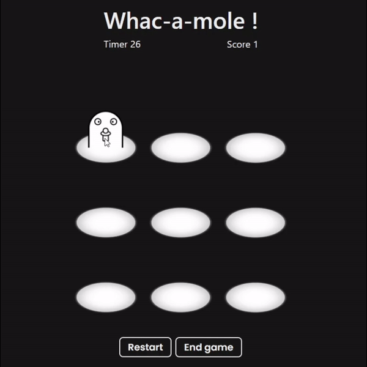
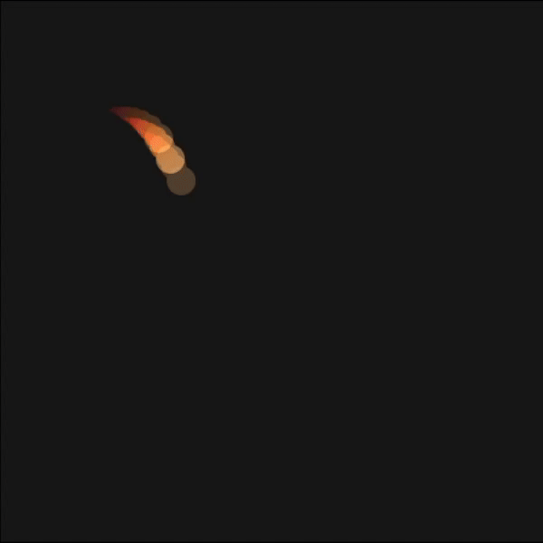
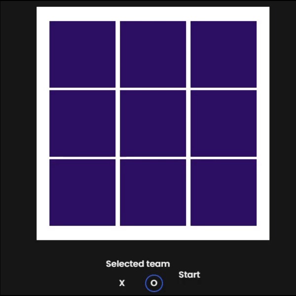
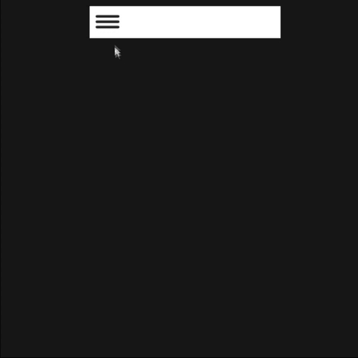

# Never Ending

**Never Ending** is a continuously evolving project built with Vue 3, TypeScript, and Tailwind CSS. ~Every day, a new mini-project is added, ranging from mini-games to components and more. The goal is to keep the creativity flowing and constantly explore new ideas and functionalities.

## Projects

### **01) Whac-a-mole**: A Whac-a-mole minigame. (20/08/2024)

  

### **02) Login form**: A login form with some basic animations. (21/08/2024)

  

### **03) Mouse effect**: A fiery animated cursor effect. (22/08/2024)

  

### **04) Tic-tac-toe**: A simple Tic-tac-toe game. (23/08/2024)

  

### **05) Hamburger menu**: A hamburger menu. (24/08/2024)

  

